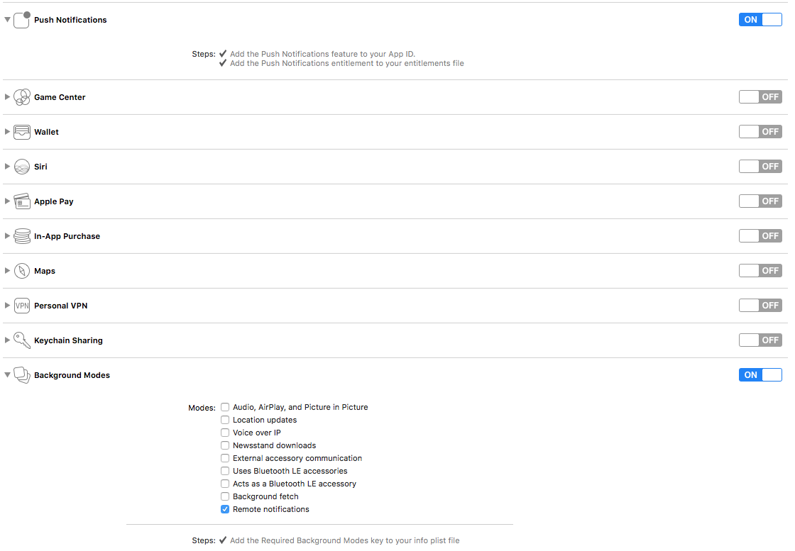

# Device Registration

On each app launch attempt to get a push notification token.

```swift
func application(_ application: UIApplication, didFinishLaunchingWithOptions launchOptions: [UIApplicationLaunchOptionsKey: Any]?) -> Bool {
    UIApplication.shared.registerForRemoteNotifications()
    return true
}
```

When you get the token, format it.

```swift
func application(_ application: UIApplication, didRegisterForRemoteNotificationsWithDeviceToken deviceToken: Data) {
    let formatted = deviceToken.reduce("", {$0 + String(format: "%02X", $1)})
}
```

Then create the following JSON to send to the push notification server. Note that if getting a token fails, you should still send the payload with a `nil` token. Also `lat` and `lng` would require you to have location permissions. Use something like [DeviceInfo](https://github.com/benjaminsnorris/DeviceInfo) to get all the information properly formatted.

```json
{
  "name" : "John's iPhone 😂",
  "locale": {
    "translation" : "en",
    "language" : "en",
    "identifier" : "en_US",
  },
  "location" : {
    "lat" : 40.7608,
    "lng" : -111.891,
    "timezone" : "America\/Denver",
  },
  "hardware" : {
    "name" : "iPhone 6S Plus",
    "version" : "iPhone8,2",
    "type" : "iPhone",
    "identifier" : "54995F65-CE13-449D-84F0-A74C51F9FB07"
  },
  "OS" : {
    "name" : "iOS",
    "version" : "10.1"
  },
  "notification_settings" : {
    "lockScreen" : "enabled",
    "alert" : "enabled",
    "alertStyle" : "banner",
    "badge" : "enabled",
    "notificationCenter" : "enabled",
    "sound" : "enabled",
    "carPlay" : "notSupported",
    "authorization" : "authorized"
  },
  "app" : {
    "name" : "Great Work",
    "version" : "2.5.2",
    "build" : "2.5.2.1674",
    "identifier" : "com.octanner.gw",
    "token" : "F702DDF80B4BD3622F8CCAEEB77657FE18AB8B71C8563622B2D9088C0BEF3383",
  },
  "screen_metrics" : {
    "density" : 3,
    "h" : 2208,
    "w" : 1242
  }
}
```

Also make sure your project has push settings turned on for background notifications so that you'll (almost) always get a push token.


