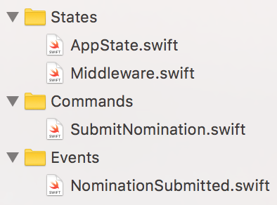

# Common iOS Infrastructure

Motivation: standardizing things that provide no unique value to an application focuses our time on providing the unique value each application has, giving us a competitive edge in the market. Some choices are made not for convenience of the developers of the app themselves, but to reduce the pain or communication burden of others who care about our products.

Items listed here include tools, libraries, conventions, and processes.

## Document Status

This is currently just a brain dump of everything I can think of. Over time we'll actually discuss and solidify each item, and things will start to take shape.


## Required

These items are required for each project we publish. Exceptions must be approved by the larger iOS team after a rousing debate of the merits and aims of removing the item.


### SwiftyBeaver — Logging

_It's awesome because:_

_Tips & Conventions:_

_People it helps:_

* iOS devs
* API devs
* Ops

_Alternatives we don't want to use:_


### Marshal — JSON Parsing

_It's awesome because:_

It's fast, type-safe, Swift-y, and great. It even lets us pull in `Date`, `URL`, `enum` and other great stuff.

_Tips & Conventions:_

1. Use the `<|` operator as much as possible for readability.

    ```swift
    init(object: MarshaledObject) throws {
        nominator = try object <| "nominator"
        connected = try object <| Keys.connected
    }
    ```

1. Define `enum`s with `RawRepresentable` values for great parsing from JSON. For example:

    ```json
    {
      "teamMemberId": "axF87b",
      "noteType": 0,
      "text": "First, we should play foosball."
    }
    ```

    ```swift
    enum NoteType: Int {
        case agenda
        case summary
    }

    struct TeamMemberNote: Unmarshaling {
        var teamMemberId: String
        var noteType: NoteType
        var text: String

        init(object: MarshaledObject) throws {
            teamMemberId = try object <| "teamMemberId"
            noteType = try object <| "noteType"
            text = try object <| "text"
        }
    }
    ```

1. Parse objects using composite keys when intermediate objects aren't valuable. For example:

    ```swift
    approval.note = try detailedObject <| "approvalAction.input.noteFromApprover.note"
    ```

_People it helps:_

* iOS devs

_Alternatives we don't want to use:_

* Plain `[String:Any]` manipulation
* [SwiftyJSON](https://github.com/SwiftyJSON/SwiftyJSON)


### Reactor — Manage app data flow

_It's awesome because:_

It's crazy-simple. It's reactish. It separates `Command`s from `Event`s. It's got `Middleware`.

_Tips & Conventions:_

1. Use separate files for each `State`, `Command`, or `Event` object. Place these into file system folders and Xcode group folders named `States`, `Commands`, `Events`.

    

1. Make all your `State` and `Event` objects implement `JSONMarshaling`. This is great for emailing support details when errors occur, and improving your own debugging.

    ```swift
    extension AppState: JSONMarshaling {
        func jsonObject() -> JSONObject {
            // details go here...
        }
    }
    ```

    ```swift
    func emailSupport() {
        let email = MFMailComposeViewController()
        email.setSubject("Need support")
        email.setMessageBody(messageText, isHTML: false)
        let json = state.recentActions.jsonObject()
        if let data = try? JSONSerialization.data(withJSONObject: json, options: [.prettyPrinted]) {
            email.addAttachmentData(data, mimeType: "json", fileName: "recent-actions.json")
        }
    }
    ```

_People it helps:_

* iOS devs

_Alternatives we don't want to use:_

* [ReSwift]()
* Standard MVC "pass data via `prepare(for segue:, sender:)`"


### XCTest — Unit and UI Testing

### ios-network-stack — Internal HTTP API calls

### Kingfisher — Image loading & caching

### Whisper — Status message UI

### Carthage — Dependency management

### version.rb — App version numbering

### Github Reviews — Code reviews

### Jenkins — Continuous Integration

### Fastlane — Automated build & deployment

### Testflight — Beta testing & distribution

### Fabric — Crash reporting and usage metrics

### OneSky — Translation

### SimpleKeychain — Typed Keychain access

### DeviceInfo — Standardized access to device properties

### DVR — UI testing network mocking

### Paw — API exploration, gathering mock data

### HTMLLabel — Display basic HTML with links and "view more"

### LaunchKit — AppReviews in Slack

### Github -> Amazon SQS trigger — Start CI builds on commit

### Github — Code

### ben/RateThisApp — Request app ratings

### ben/ShareThisApp — Share the app

### ben/EmailSupport — Send a support request email


## To Be Created, and Required

### Credits — Team credits & open source licenses

### Unnamed — Internal push notification server

### ReachabilityReactor — Monitor network reachability with State

### Dateful — Convenient date handling

### Migrations — Perform actions when installed app version changes

### .gitignore — Common configuration for ignoring files on our projects

### ClearTest — Xcode plugin to make test names into readable comments


## Recommended

### Intercom — Customer support

### CustomTabBar — Tab bar with highlight

### LocationReactor — Monitor location changes with State


## As Needed


## Interesting

### SupportKit — messaging SDK for user feedback

### Chisel — LLDB commands

### Realm — local and server data syncing

### AlamoFire — common networking

### SwiftLint — Coding style enforcement


## Sources of Inspiration

[My iOS Development Toolkit 2016](https://medium.com/ios-os-x-development/my-ios-development-toolkit-2016-ba7601b68085#.lpdd2q1x0) by Sebastian Boldt

[iOS Tools List](https://iosdev.tools)

