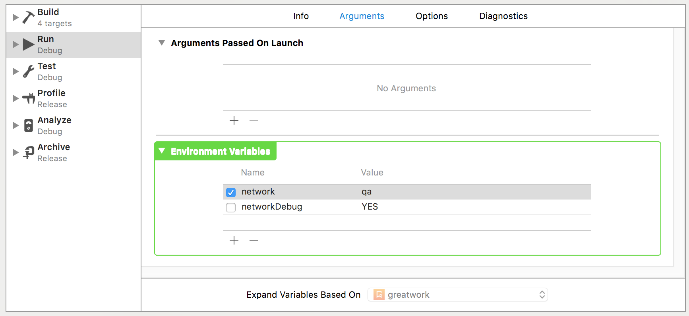

# Common iOS Patterns

**Motivation:** doing standard things in the same way each time makes it easy to ignore the mundane parts of them, to recognize quickly what's going on, and to later update every instance of its use throughout the app when we change how we want it done.

### Document Status

This is currently just a brain dump of everything I can think of. Over time we'll actually discuss and solidify each item, and things will start to take shape.

## Table of Contents


# Required

These things _must_ be done the same way across every project in order to pass a code review.

## Extract Xcode Build Phases into Separate Scripts

_It's awesome because:_

Xcode project files store scripts as one long line, making diffing impossible, syntax highlighting is non-existant, and the change history is muddled with the project edits. This pattern brings all those back.

_How it works:_

Extract all Build Phase logic out of the Xcode text box for that phase and into a separate script file that is simply invoked from the build phase. We've selected most of the advice from Giovanni Lodi's article, [Better Xcode Run Script Build Phases](http://www.mokacoding.com/blog/better-build-phase-scripts).

Make the scripts smart enough to check for the tools they require, and to report errors when they fail. Add `set -x` to ensure the scripts echo all the commands they run.

Report errors:

```sh
echo "error: Your error message"
echo "warning: Your warning message"
```

Check for tools:

```sh
if ! which <your tool> > /dev/null; then
  echo "error: <your tool> is missing"
  exit 1
fi
```

_Tips & Conventions:_

* Place scripts in the `<appName>/scripts/` directory of the repo.
* Name the Build Phase to describe what the script will do.

_Alternatives we don't want to use:_

* Script contents coded into the Xcode project file

## Empty states with UITableView

Use [secondary views](https://blog.curtisherbert.com/secondary-views/) in storyboards to build out your empty state views.

_It's awesome because_

You can build the empty state view out in storyboards separately from your viewController to keep your ViewController looking clean. It's also really easy to add and remove the view from the tableview when needed.

_How it works_

1. In storyboards, drop a `UIView` into the `ToolBar` or your ViewController. The same as if you were adding an NSObject to the ViewController to create a UITableViewDataSource

1. Create your view how you'd like it to appear, adding views and labels and even buttons.

    

1. Then create an outlet to your secondary view in your ViewController.

    ```swift
    @IBOutlet var emptyStateView: UIView!
    ```

1. To show the empty state view just add that view as the `backgroundView` of the tableView when the tableView is empty.

    ```swift
    tableView.backgroundView = emptyStateView
    ```

1. To remove the view, just set the `backgroundView` to nil

    ```swift
    tableView.backgroudView = nil
    ```

_Tips & Conventions:_

 * Make sure the outlet is `strong` instead of `weak` because we're possibly removing these views after we show them. If we remove a weak view from the main screen then nothing is left holding onto the view, so the IBOutlet would turn nil and we'd never be able to re-show it


_Alternatives we don't want to use:_

* Hiding the tableView and showing a different view on top or underneath.

## Keyboard handling

_It's awesome because:_

_How it works:_

_Tips & Conventions:_

_Alternatives we don't want to use:_

# Recommended

## Compatible Versioning: major.minor only

Use [Compatible Versioning](https://github.com/staltz/comver) (ComVer) instead of Semantic Versioning (SemVer), for both app marketing and library release version numbers.

_It's awesome because:_

It simplifies versioning down to, "Is this version backwards compatible or not?" and makes nicer looking marketing version numbers for users.

It also takes the guesswork out of deciding on a marketing version.

_How it works:_

Increment the MAJOR version when you make backwards-incompatible updates of any kind MINOR version when you make 100% backwards-compatible updates

_Tips & Conventions:_

* Continue to add a build number to the marketing number for the app, making this number use 3 segments instead of 4.
* Continue to tag each release of a library with `major.minor.0` to satisfy current Swift Package Manager behavior (Jan 2017) which requires full SemVer tags. This is 100% semantically equivalent to ComVer.

_Alternatives we don't want to use:_

* [SemVer](http://semver.org)

## Naming and defining colors

_It's awesome because:_

You know exactly where to go to change any built-in color used by your app. This doesn't apply to dynamic colors used based on API values.

_How it works:_

Define all common colors used in your app inside a `UIColor` extension in a file called `UIColor+MyApp.swift`. Use color literals over hex initializers, etc., as it is much easier for developer brains to interpret. To add a color literal start typing `#color` in Xcode and autocomplete should help you out.


_Tips & Conventions:_

_Alternatives we don't want to use:_

* `UIColor(hex: 0xabcdef)`
* Color definitions all over the code.

## App root view controller

## Naming and defining fonts

## Handle font accessibility sizing

## Safely test network and configurations

_It's awesome because:_

You can safely configure any part of your app, because these values can't ever be set on user devices.

_How it works:_

1. Set the desired environment variables in your scheme's Run configuration. You find them under the Arguments tab.

    

1. Hide environment variable access behind a `ProcessInfo` extension. Combine this with the `Keys.pattern` below. Create calculated variables for common access patterns.

    ```swift
    extension ProcessInfo {

        static var hideUI: Bool {
            return ProcessInfo.processInfo.environment["hideUI"] == "YES"
        }

        static var network: String? {
            return ProcessInfo.processInfo.environment[Keys.network]
        }

        static var isTakingSnapshots: Bool {
            return ProcessInfo.network == Keys.snapshots
        }

    }
    ```

1. _Judiciously_ use them to customize the app's behavior for testing scenarios.

    ```swift
    @UIApplicationMain class AppDelegate: UIResponder, UIApplicationDelegate {

        func application(_ application: UIApplication, didFinishLaunchingWithOptions launchOptions: [UIApplicationLaunchOptionsKey: Any]?) -> Bool {
            if let network = ProcessInfo.network, token = ProcessInfo.token {
                MyAPI().authenticate(with: token)
            }
            return true
        }

    }
    ```

1. Setup the values in your UI tests in `setUp` before you launch the app.

    ```swift
    override func setUp() {
        super.setUp()
        let app = XCUIApplication()
        setupSnapshot(app)

        app.launchEnvironment["network"] = "snapshots"
        app.launchEnvironment["token"] = "0c8268b219aa28b31fde48e40c4aca8"
        app.launch()
    }
    ```

_Tips & Conventions:_

* We much prefer environment variables over launch arguments. Launch arguments can be accessed via `UserDefaults`, which creates the (remote) possibility that this debug behavior may be triggered on user devices.
* Because this behavior can't be triggered on user devices, we don't protect the places that use it with `#if DEBUG` unless they use some private API that can't ship to the App Store.

_Alternatives we don't want to use:_

* Launch arguments
* Settings.app settings
* In-App debug settings UI

## Manage global appearance

## Segues and view controller initialization from storyboards

## Organize dictionary and JSON key strings

## Use semantic names for fonts and colors in storyboards

## Pluralize: Mix numbers and nouns and do it really well

## Typed UserDefaults storage

_TBD: mention listing stored items for security audit_

## Switch environments and API servers

## Access debug information for bug reporting

## Optimistically update state and revert on error

## Give the team credit somewhere

## Automate screenshots in every language

## Automate App Store demo video

## User data migration and deprecation patterns

## Error Handling

### Logging errors effectively

### Displaying errors to the user

### Translating error messages

## Resetting state when a view is dismissed

## Demo user data for App Review and screenshots

## State patterns for handling API request status

# As Needed


# Interesting
